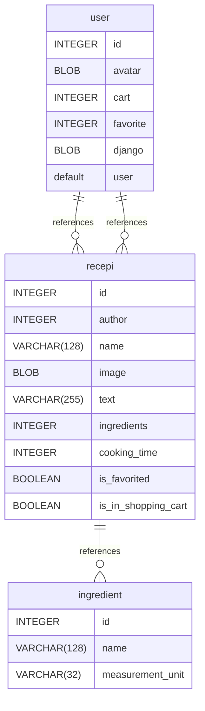

# Untitled Diagram documentation
## Summary

- [Introduction](#introduction)
- [Database Type](#database-type)
- [Table Structure](#table-structure)
	- [recepi](#recepi)
	- [ingredient](#ingredient)
	- [user](#user)
- [Relationships](#relationships)
- [Database Diagram](#database-diagram)

## Introduction

## Database type

- **Database system:** SQLite
## Table structure

### recepi

| Name        | Type          | Settings                      | References                    | Note                           |
|-------------|---------------|-------------------------------|-------------------------------|--------------------------------|
| **id** | INTEGER | 🔑 PK, not null, unique, autoincrement |  | |
| **author** | INTEGER | not null |  | |
| **name** | VARCHAR(128) | not null, unique |  | |
| **image** | BLOB | not null |  | |
| **text** | VARCHAR(255) | not null |  | |
| **ingredients** | INTEGER | not null | fk_recepi_ingredients_ingredient | |
| **cooking_time** | INTEGER | not null |  | |
| **is_favorited** | BOOLEAN | not null, default: False |  | |
| **is_in_shopping_cart** | BOOLEAN | not null, default: False |  | | 

### ingredient

| Name        | Type          | Settings                      | References                    | Note                           |
|-------------|---------------|-------------------------------|-------------------------------|--------------------------------|
| **id** | INTEGER | 🔑 PK, not null, unique, autoincrement |  | |
| **name** | VARCHAR(128) | not null |  | |
| **measurement_unit** | VARCHAR(32) | not null |  | | 

### user

| Name        | Type          | Settings                      | References                    | Note                           |
|-------------|---------------|-------------------------------|-------------------------------|--------------------------------|
| **id** | INTEGER | 🔑 PK, not null, unique, autoincrement |  | |
| **avatar** | BLOB | not null |  | |
| **cart** | INTEGER | not null | fk_user_cart_recepi | |
| **favorite** | INTEGER | not null | fk_user_favorite_recepi | |
| **django default user** | BLOB | not null |  | | 

#### Indexes
| Name | Unique | Fields |
|------|--------|--------|
| user_index_0 |  | cart, favorite |
## Relationships

- **recepi to ingredient**: one_to_many
- **user to recepi**: one_to_many
- **user to recepi**: one_to_many

## Database Diagram

